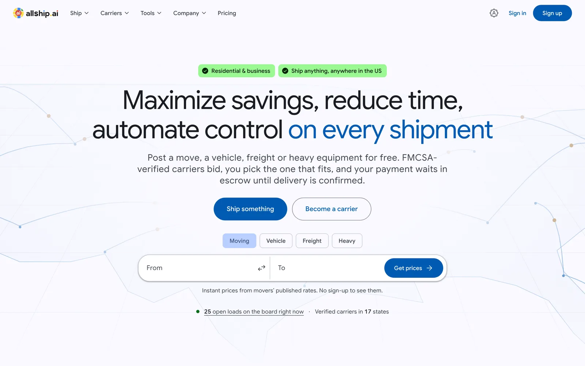
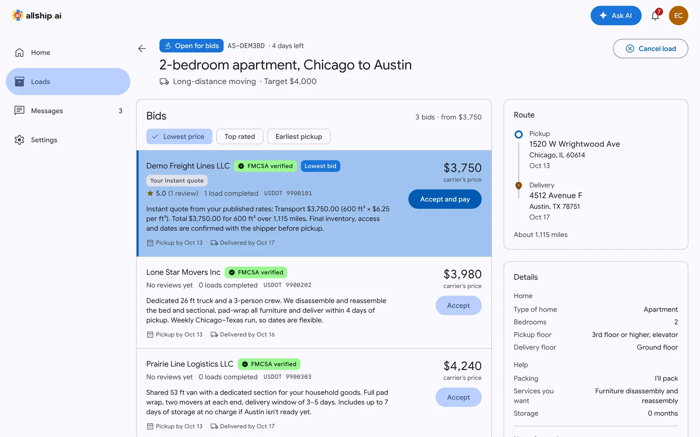
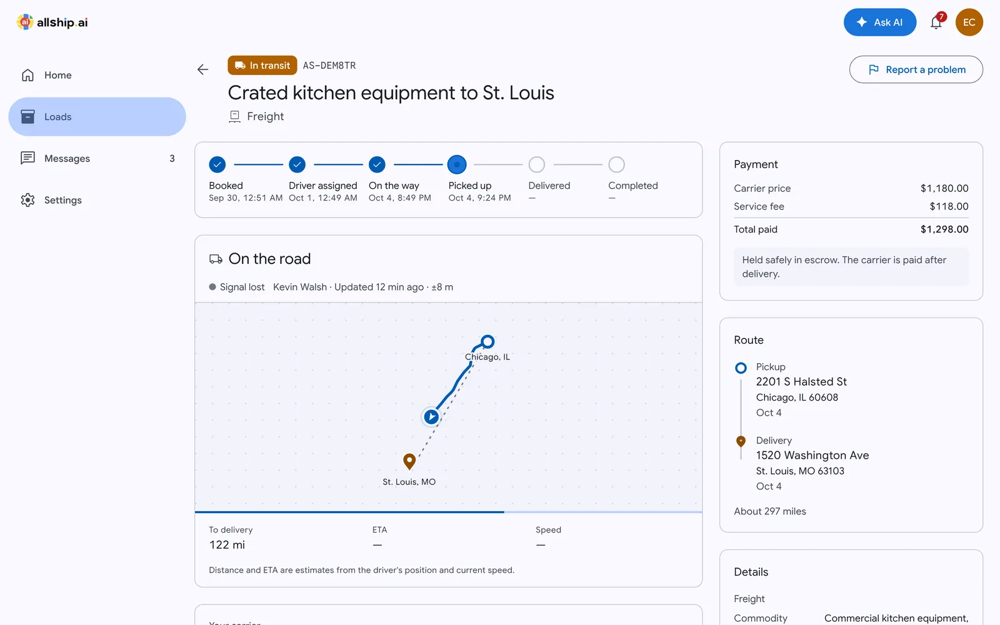
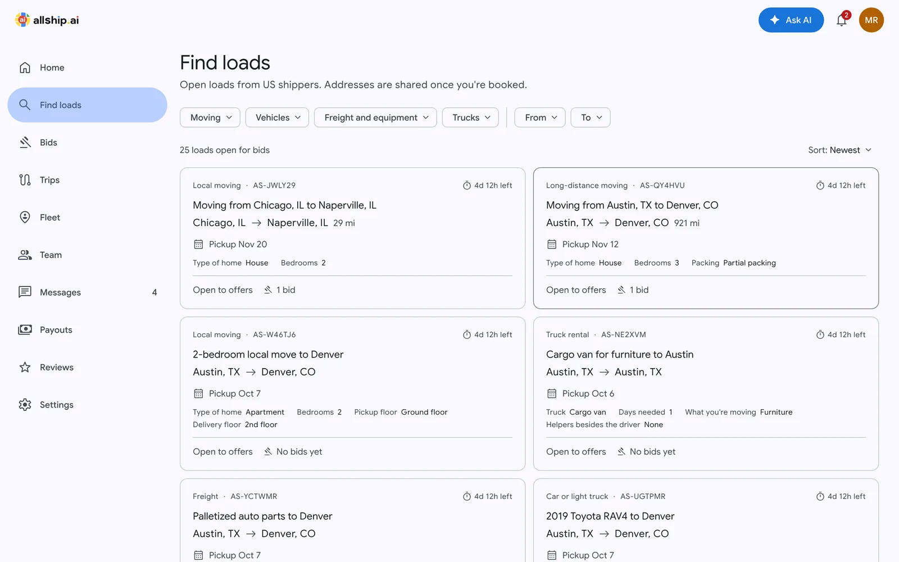
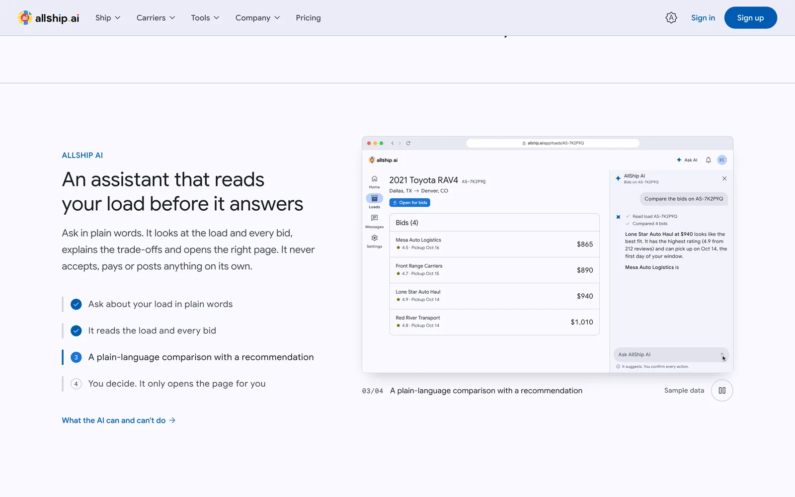
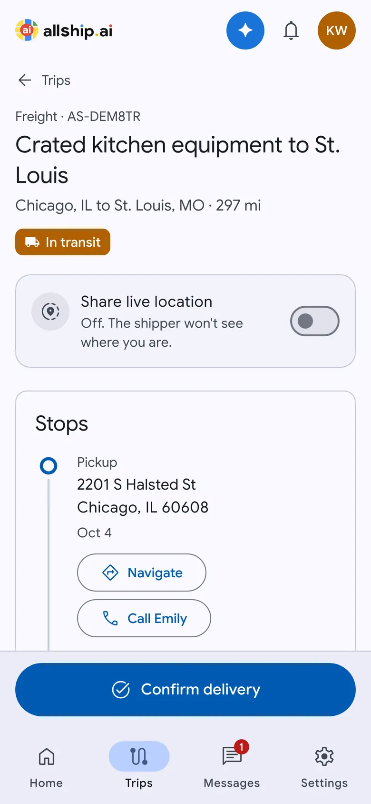

## Yaroslav Tsarenko

Full-stack engineer from Ukraine. I build products end to end — data model, payments, dashboards, the marketing site that sells them — mostly in **TypeScript, Next.js, Node.js and Postgres**.

3.5+ years of commercial work. A lot of it is money: Stripe and Stripe Connect escrow, PayPal, high-risk card processors, wallet ledgers that can't double-charge. Lately also AI features that work on real user data instead of demo prompts.

Open to a full-time remote role · [yaroslavtsarenkodev@gmail.com](mailto:yaroslavtsarenkodev@gmail.com)

 

---

### Featured — [AllShip AI](https://github.com/yaroslav-tsarenko/allship-ai)

**A US marketplace for moving, vehicle, freight and heavy-equipment shipping.** Shippers post a load, FMCSA-verified carriers bid, and the shipper's money waits in escrow until delivery is confirmed.

I worked on the original AllShip for over two years — three repos, Express + MongoDB, no escrow, bots in the database. In 2026 I rebuilt it alone as one Next.js app and moved the real users, carriers and rate cards across.

<a href="https://github.com/yaroslav-tsarenko/allship-ai">
<picture>
  <source media="(prefers-color-scheme: dark)" srcset="assets/allship/home-hero-dark.webp">
  
</picture>
</a>

| | |
|---|---|
| **Role** | Solo — product, architecture, design system, frontend, backend, payments, security, data migration |
| **Size** | ~69k lines of TypeScript · 98 pages · 46 Postgres tables · dashboards for 4 roles + admin |
| **Stack** | Next.js 16 · React 19 · Drizzle · Supabase (Postgres, Realtime, Storage) · Better Auth · Stripe Connect · OpenAI |
| **Quality** | Strict TypeScript · 290 unit tests · DB-backed authorization tests · CI on every push |

<table>
<tr>
<td width="50%" valign="top">

<b>Bid comparison.</b> Instant quotes are priced from each carrier's published rate card, not guessed. Ratings come only from real reviews.
</td>
<td width="50%" valign="top">

<b>Live trip.</b> Status stepper, GPS trail, ETA and signal-lost detection over Supabase private broadcast channels.
</td>
</tr>
<tr>
<td width="50%" valign="top">

<b>Carrier load board.</b> Filters live in the URL; every bid shows what the carrier receives and what the shipper pays.
</td>
<td width="50%" valign="top">

<b>AI assistant.</b> OpenAI Responses API with role-scoped read-only tools. It suggests actions as buttons; the user confirms.
</td>
</tr>
</table>

<table>
<tr>
<td width="30%" valign="top"></td>
<td valign="top">

**What's under the hood**

- **Escrow with a double-entry ledger.** Separate charges and transfers on Stripe Connect; payouts use `source_transaction`, so money never moves before it settles. Every journal sums to zero. Idempotent webhooks.
- **Authorization audit of 109 entry points** against the OWASP API Top 10. Found and fixed a role-switch exploit, competitor bid leaks and accept-vs-pay races.
- **Realtime without exposing the database.** RLS on every table, no client grants; the server signs short-lived JWTs listing exactly the channels a user may join.
- **Driver flow on the web.** Live location with `watchPosition` + Wake Lock, pickup/POD photos resized in the browser, signature on canvas.
- **Marketing site that ships the real UI.** A ~10 KB engine plays scripted demos built from the app's own components instead of screenshots. Raw WebGL2 hero, JSON-LD, segmented sitemaps, Consent Mode v2.

[Read the full case study →](https://github.com/yaroslav-tsarenko/allship-ai#readme)

</td>
</tr>
</table>

 

---

### Other work

**[Floatline](https://github.com/yaroslav-tsarenko/floatline)** — CS2 skins marketplace on top of an aggregator of 28+ trading platforms. The wallet is an append-only ledger with idempotency keys on every entry, so redelivered payment webhooks and concurrent purchases can't double-credit. Orders reconcile from both webhooks and a polling job without double-applying. Background work runs as cron routes inside Next — no extra services.
Next.js 16 · Drizzle · Neon Postgres · pg_trgm search · multi-currency display over USD storage

**[Keyarcade](https://github.com/yaroslav-tsarenko/keyarcade)** — digital game-key store on the Kinguin API: live catalog with a local fallback when the API is down, accounts, checkout that issues keys, PDF invoices by email. Visual language of a physical game shop — boxed titles, rotated price stickers, hard offset shadows.
Next.js 16 · Neon · pdfkit · nodemailer · OAuth2 fallback auth

**[Datumskins](https://github.com/yaroslav-tsarenko/datumskins)** — CS2 skins store designed as an engineering drawing: every listing is a spec sheet with a wear gauge, grade and trade status. Steam trade-offer delivery, i18n, a power-user parts-list view.
Next.js 16 · Prisma 7 · Postgres · next-intl

| Project | What it is | Stack |
|---|---|---|
| [Kirosim](https://github.com/yaroslav-tsarenko/kirosim) | Travel eSIM store; same commerce core as [Velusim](https://github.com/yaroslav-tsarenko/velusim), new token-based design system | Next.js 16 · Neon |
| [E-commerce platform](https://github.com/yaroslav-tsarenko/e-commerce-store-beta) | Storefront + admin: CSV/Excel import, Google/Facebook product feeds, CMS, analytics | Next.js 16 · Prisma · next-intl |
| [Cartridge Club](https://github.com/yaroslav-tsarenko/cartridge-club) | Game-key store UI built on a strict design-token system, WCAG AA | Next.js 15 · Tailwind v4 |
| [AIFitWorld](https://github.com/yaroslav-tsarenko/aifitworld-own) | Generates personalised workout programs with GPT-4 and DALL·E 3 | Next.js · OpenAI |

Plus a steady stream of client work I can't open-source: payment integrations, proxy-service sites, PDF-generation apps, booking flows.

 

---

### Toolbox

| | |
|---|---|
| **Frontend** | React, Next.js (App Router, RSC, Server Actions), TypeScript, Tailwind, Radix, GSAP, WebGL |
| **Backend** | Node.js, Express, Next route handlers, PostgreSQL, Drizzle, Prisma, Supabase, MongoDB |
| **Payments** | Stripe, Stripe Connect, PayPal, high-risk PSPs, webhooks, ledgers, refunds and disputes |
| **AI** | OpenAI (Responses API, tool calling, streaming), AI features scoped to user data, agentic dev tools |
| **Ops** | Vercel, GitHub Actions, Sentry, Resend, Vitest, Playwright |
